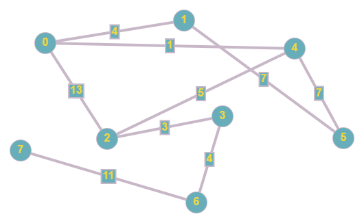
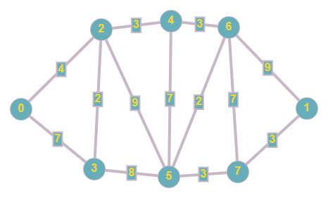

# Depth First Search (DFS)

Muhammad Ilham Mubarak - IF-43-INT - 1301194276

An implementation of DFS using C++

This repository contains an implementation of DFS to an undirected weighted graph
The algorithm begin from a starting vertex, and proceeds to all other vertex in the graph with the lowest weight edge as a prioritize

## Inputs

You can pick an input from these files. Pick the menu `1` and choose the file by their number. The graph is as follows

<table>
    <tr>
        <th>No</th>
        <th>Image</th>
        <th>File</th>
    <tr>
    <tr>
        <td>1</td>
        <td>
          
        </td>
        <td>1.in</td>
    <tr>
    <tr>
        <td>2</td>
        <td>
          
        </td>
        <td>2.in</td>
    <tr>
</table>
