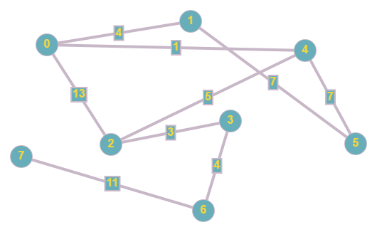

# Depth First Search (DFS)

An implementation of DFS using C++

This repository contains an implementation of DFS to an undirected weighted graph
The algorithm begin from a starting vertex, and proceeds to all other vertex in the graph with the lowest weight edge as a prioritize

# Inputs

<table>
    <tr>
        <th>Name</th>
        <th>Image</th>
        <th>File</th>
    <tr>
    <tr>
        <td>Graph 1</td>
        <td>
          
        </td>
        <td>1.in</td>
    <tr>
</table>
